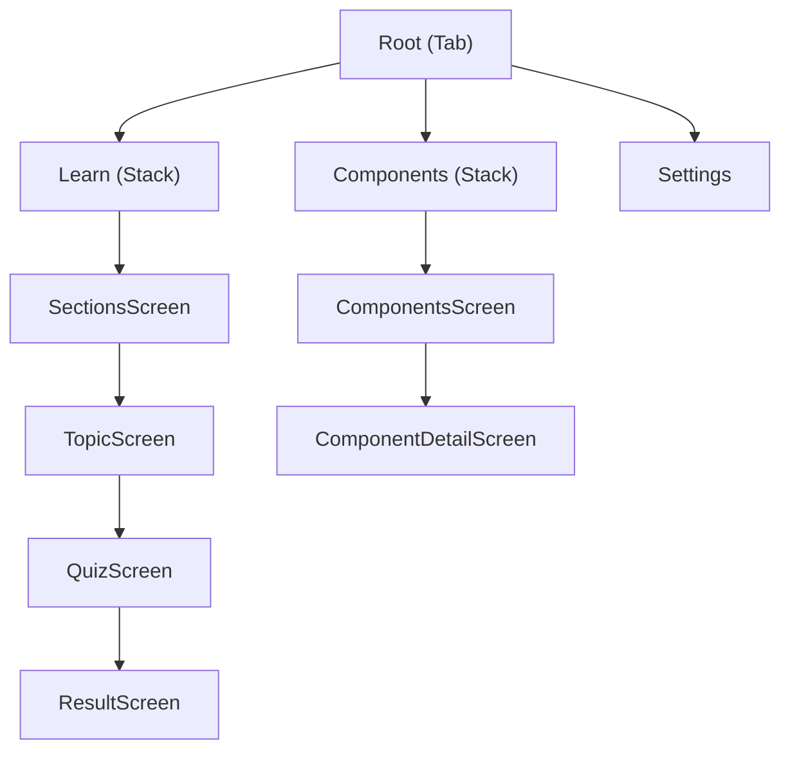

# Architecture — React Native Bible

## Overview

Offline-first reference app for intermediate and advanced React Native developers. No backend, no authentication — all content lives in local JSON files and all state persists on device.

---

## Structure

The codebase is organized by feature — each folder groups everything related to a user-facing capability: screens, hooks, components, and logic.

```
src/
  features/
    learn/       ← sections, topics, quiz
    components/  ← RN components reference
    settings/    ← theme, language
  components/    ← shared components
  navigation/
  stores/
  content/       ← local JSON files
  theme/
```

---

## Feature structure

Each feature follows the same internal convention:

```
learn/
  screens/
    QuizScreen.tsx     ← view
  hooks/
    useQuiz.ts         ← viewmodel
  utils/
    quiz.ts            ← model (pure functions)
    quiz.test.ts
  components/          ← shared between screens of this feature
```

The naming is intentional — `QuizScreen`, `useQuiz`, and `quiz.ts` map directly to view, viewmodel, and model. Components that are only used by a single screen live in that screen's file. Components shared across features live in `src/components/`.

---

## Pattern

MVVM. Screens have no logic — they render what the hook returns and delegate interactions back to it. Hooks orchestrate logic and persistence. Pure functions handle computation with no React dependencies.

```ts
// hook
function useQuiz() {
  const [options, setOptions] = useState([]);
  const load = () => setOptions(selectOptions(question)); // ← pure function
  return { options, load };
}

// screen
function QuizScreen() {
  const { options, load } = useQuiz(); // ← only renders
  return <View>{options.map(o => <Text>{o}</Text>)}</View>;
}
```

---

## Main libraries

| Library | Usage |
|---|---|
| React Navigation | Stack and tab navigation |
| Zustand | Global state management |
| AsyncStorage | On-device persistence |
| Jest | Unit tests |

---

## Conventions

**Types over interfaces** — `type` is used throughout the project. `interface` is never used.

**Types convention:**
- Component props — always inline in the component file, named `ComponentNameProps`
- Domain and entity types — always in the feature's `types.ts`
- Store types — always in the store's `types.ts`
- Internal utility types — stay in the file where they are used

**Stores** — Zustand stores are created with `create<T>()` and exported directly as hooks (`useSettingsStore`, `useQuizStore`). Each store lives in its own folder under `src/stores/` with an `index.ts` and a `types.ts`.

```
src/
  stores/
    settings/
      index.ts    ← useSettingsStore
      types.ts
    quiz/
      index.ts    ← useQuizStore
      types.ts
```

---

## Navigation


