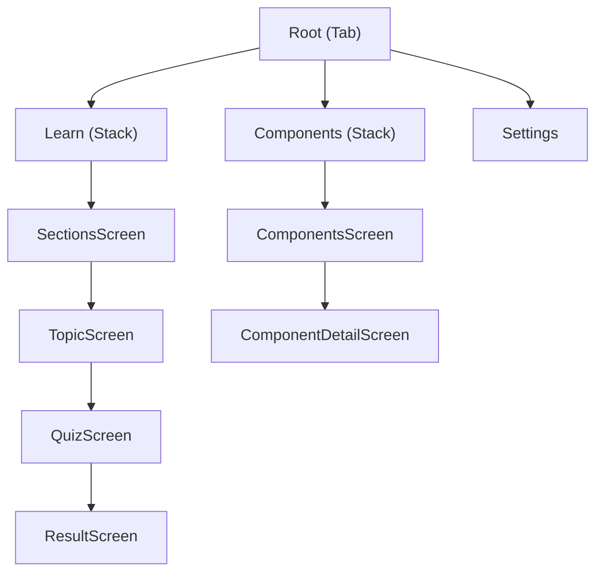

# Architecture — React Native Bible

## Overview

Offline-first reference app for intermediate and advanced React Native developers. No backend, no authentication — all content lives in local JSON files and all state persists on device.

---

## Structure

The codebase is organized by feature — each folder groups everything related to a user-facing capability: screens, hooks, components, and logic.

```
src/
  features/
    learn/       ← sections, topics, quiz
    components/  ← RN components reference
    settings/    ← theme, language
  components/    ← shared components
  hooks/         ← shared utility hooks
  navigation/
  stores/
  content/       ← local JSON files
  theme/
skills/          ← tooling skills for content authoring and maintenance
```

---

## Feature structure

Each feature follows the same internal convention:

```
learn/
  screens/
    QuizScreen.tsx     ← view
  hooks/
    useQuiz.ts         ← viewmodel
  utils/
    quiz.ts            ← model (pure functions)
    quiz.test.ts
  components/          ← shared between screens of this feature
```

The naming is intentional — `QuizScreen`, `useQuiz`, and `quiz.ts` map directly to view, viewmodel, and model. Components that are only used by a single screen live in that screen's file. Components shared across features live in `src/components/`.

---

## Pattern

MVVM. Screens have no logic — they render what the hook returns and delegate interactions back to it. Hooks orchestrate logic and persistence. Pure functions handle computation with no React dependencies.

```ts
// hook
function useQuiz() {
  const [options, setOptions] = useState([]);
  const load = () => setOptions(selectOptions(question)); // ← pure function
  return { options, load };
}

// screen
function QuizScreen() {
  const { options, load } = useQuiz(); // ← only renders
  return <View>{options.map(o => <Text>{o}</Text>)}</View>;
}
```

---

## Internationalisation (i18n)

**Supported languages:** English (`en`), Portuguese (`pt`), Spanish (`es`)

The translation system has two distinct layers with different purposes:

**Layer 1 — UI strings** `src/i18n/locales/{lang}.json`

Short labels used by the app shell: navigation tabs, settings screen, shared actions. Keys are namespaced by feature (`settings.title`, `components.props`, `components.tags.interaction`, etc.).

**Layer 2 — Feature content** `src/i18n/content/{lang}/`

Long-form content for the reference tabs. Each feature has its own file:

| File | Content |
|---|---|
| `components.json` | Subtitles, descriptions, prop descriptions, gotchas for each RN component |
| `learn.json` | Titles, subtitles, and body blocks for each Learn topic |
| `quiz.json` | Questions, explanations, and answer options for each section quiz |

All keys are accessed with the `content.` prefix — e.g. `t("content.button.description")`, `t("content.flexbox_basics.title")`.

**Type safety:** `src/i18n/types.ts` declares `CustomTypeOptions` merging both layers into the `translation` namespace. Each feature derives its own content key union directly from the English JSON, so invalid keys are caught at compile time:
- `ComponentContentKey` — in `src/content/components/types.ts`, derived from `en/components.json`
- `LearnContentKey` — in `src/features/learn/types.ts`, derived from `en/learn.json`
- `QuizContentKey` — in `src/features/learn/types.ts`, derived from `en/quiz.json`

**Conventions:**
- `common` — shared strings used across multiple screens (`close`, `cancel`, `save`, etc.)
- Feature keys mirror the feature name (`settings.title`, `learn.sections`, etc.)
- Component names, prop names, platform terms, and anything inside backticks are never translated
- `t()` is never called directly in screens — strings are resolved in the viewmodel hook and returned inside a `strings` object

---

## Content systems

Both the Learn and Components tabs have a dedicated content layer — a set of typed data files that live outside the feature logic and are registered in an `index.ts`.

### Learn content system

```
src/
  content/
    learn/
      index.ts          ← registers all Section and Topic entries
      LEARN_CONTENT.md  ← content map: sections and topics planned or implemented
      assets/           ← images referenced by topic body blocks
  i18n/
    content/
      en/learn.json     ← source of truth for content keys
      pt/learn.json
      es/learn.json
  content/
    quiz/
      index.ts          ← registers SectionQuiz entries (questions per section)
      QUIZ_CONTENT.md   ← content map for quiz questions
  i18n/
    content/
      en/quiz.json      ← source of truth for quiz content keys
      pt/quiz.json
      es/quiz.json
```

`Section` and `Topic` are the central types (defined in `src/features/learn/types.ts`). A `Topic.body` is an ordered array of `ContentBlock` — `heading`, `text`, `code`, or `image`. `heading` and `text` blocks hold `LearnContentKey` values resolved at render time; `code` blocks hold literal strings. `LearnContentKey` is derived directly from `en/learn.json`, so invalid keys are compile errors.

### Components content system

```
src/
  content/
    components/
      index.ts                    ← registers all components by tag
      types.ts                    ← RNComponent, ComponentProp, PreviewProps, ComponentContentKey
      componentProps/
        button.tsx                ← one file per component
        flatlist.tsx
        ...
  i18n/
    content/
      en/components.json          ← source of truth for content keys
      pt/components.json
      es/components.json
```

**`RNComponent`** is the central type. Key fields:
- `subtitle`, `description`, `gotchas[]` — typed as `ComponentContentKey`, a union derived from `en/components.json` with the `content.` prefix. TypeScript rejects invalid keys at compile time.
- `previewComponent` — typed as `(props: PreviewProps) => React.ReactElement`. Always a named uppercase function defined above the exported object. Import `PreviewProps` from `@content/components/types` when the preview uses the `focused` prop.
- `hasScroll?: boolean` — set to `true` for components whose preview contains a scrollable list (`FlatList`, `ScrollView`, `SectionList`). Tells the detail screen to show a focus-toggle button so the preview's scroll doesn't conflict with the page scroll.

The hook `useComponentDetail` translates all content fields through `t()` before returning them to the screen, so screens always receive resolved strings.

---

## Main libraries

| Library | Usage |
|---|---|
| React Navigation | Stack and tab navigation |
| Zustand | Global state management |
| AsyncStorage | On-device persistence |
| Jest | Unit tests |

---

## Conventions

**Types over interfaces** — `type` is used throughout the project. `interface` is never used.

**Hooks convention:**
- Screen viewmodel hooks use the `Screen` suffix: `useLearnScreen`, `useTopicScreen`, `useQuizScreen`, `useResultScreen`, `useComponentsScreen`, `useComponentDetailScreen`
- Component hooks use no suffix: `useTopicCard`, `useNativeComponentCard`, `useSectionHeader`
- Shared utility hooks live in `src/hooks/` and use no suffix: `useScrollReveal`, etc.

**Component file convention:**
Each shared component lives in its own folder under `src/components/`. The component is defined directly in `index.tsx` — no separate `ComponentName.tsx` with a re-exporting `index.ts`. Utility helpers (e.g. `Button.utils.ts`, `Text.utils.ts`) stay as sibling files in the same folder.

```
src/components/
  Button/
    index.tsx       ← component defined here
    Button.utils.ts ← helpers alongside
  Text/
    index.tsx
    Text.utils.ts
```

**Types convention:**
- Component props — always inline in the component file, named `ComponentNameProps`
- Domain and entity types — always in the feature's `types.ts`
- Store types — always in the store's `types.ts`
- Internal utility types — stay in the file where they are used

**Stores** — Zustand stores are created with `create<T>()` and exported directly as hooks (`useSettingsStore`, `useQuizStore`). Each store lives in its own folder under `src/stores/` with an `index.ts` and a `types.ts`.

```
src/
  stores/
    settings/
      index.ts    ← useSettingsStore
      types.ts
    quiz/
      index.ts    ← useQuizStore
      types.ts
```

---

## Navigation


